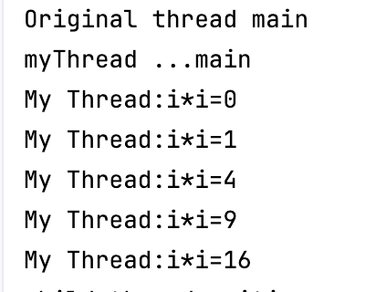
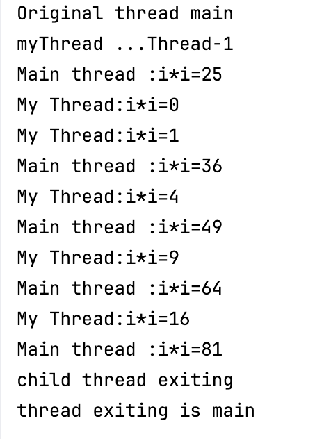

# Java-Fundamentals

## creating threads

### Extending Thread class

  * must override the run method and call start method to fork new thread fromm parent thread
  * Instead if you call run method instead of start() then no new thread is not created
  * Output of  when call myThread.run() from main method
    * ---------------------------No new Thread is created-----------------------------------------------
      * __Original thread main__
        __myThread ...main__
      * 
        
      
  * Output for myThread.start()
    * -----------------------------New thread gets created---------------------------------------------
      * __Original thread main__
        __myThread ...Thread-1__
        
        
      
### Implementing Runnable interface (MyRunnableThread.java)

1. Create a class that implements _Runnable_
2. Override the _run()_ method - This conatins code that will run in the thread
3. create a __Thread__ object, passing your runnable instance to the _Thread constructor_
4. Start the Thread using _thread.start()_
