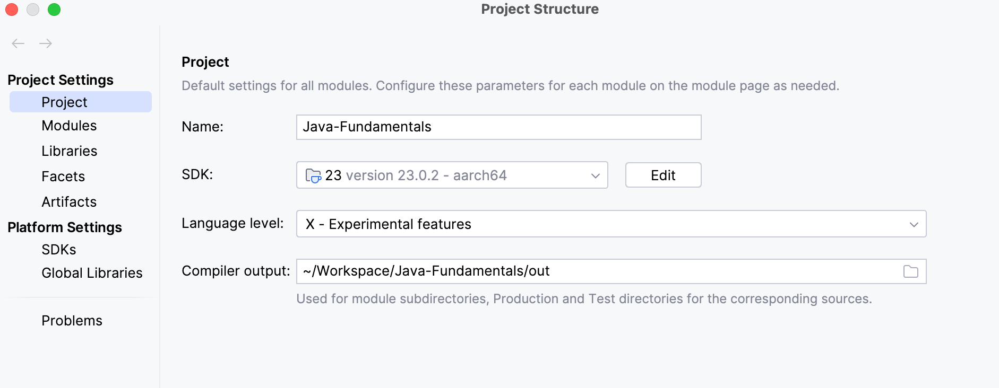

# Java-Fundamentals

## Project Setup
* For enabling java 23 experimental features
  * Install java 23 locally using jenv
  * enable preview features at following path(check screenshot)
    * 
    * File --> Project Structure --> Project Settings --> Project --> Language Level --> chose X-Experimental features

## Topics covered

* MultiThreading - refer Multithreading.md inside multithreading folder

## Technical Requirements

1. As, java 23 is no longer supported by Homebrew ,we need to install 24.

__Steps to install any java version__
  * Use `brew search opendk` to search for available LTS versions ,or
  * check https://formulae.brew.sh/formula/openjdk to search for both LTS version and other latest versions 
    supported by homebrew.
  * `brew install openjdk@24`
  * `jenv add /opt/homebrew/opt/openjdk@24`
  * `jenv local 24`
  * `java -version` or,
  * `jenv versions to confirm installation`

2. __Jenv Guide__
 https://github.com/jenv/jenv
